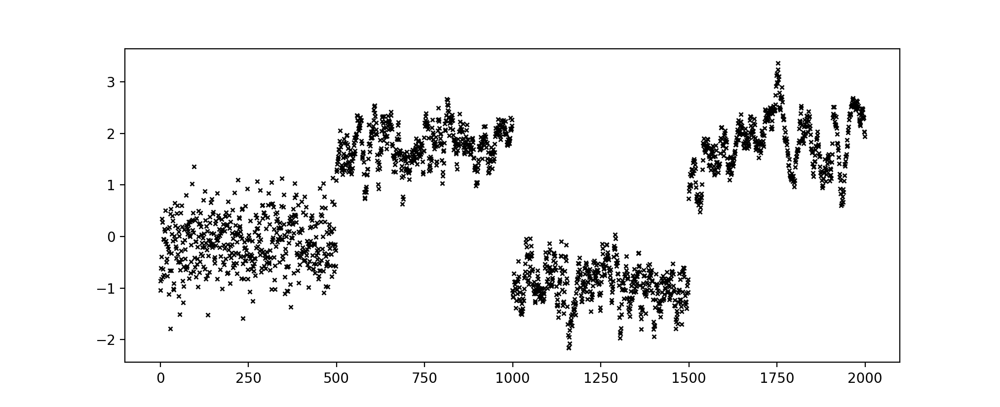
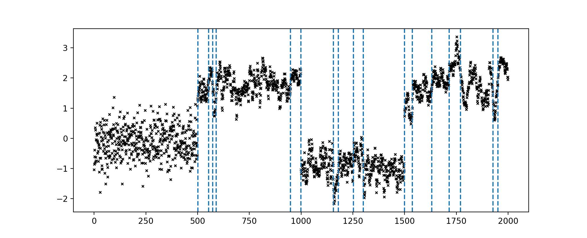
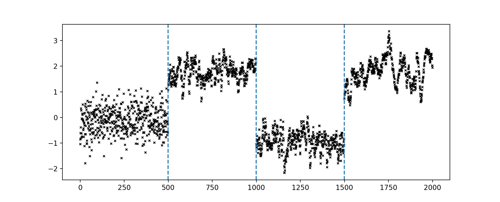

# Moving-sum changepoint model

Python code for the article: Hallgren K. L., Heard N. A. and Adams N. (2021). "Changepoint detection in non-exchangeable data". In: arXiv e-prints.

The novel changepoint model, the simulation study and the datasets are introduced in the article.

Address for questions: karl.hallgren17@imperial.ac.uk

The code is organised into two folders as described below.

## model_sampler

Code to sample from the moving-sum changepoint model.

* Class `Segment` in `segment.py`: an object corresponds to a segment of the moving-sum changepoint model.

* Class `ChangepointModel` in `changepoint_model.py`: an object corresponds to a moving-sum changepoint model.

* Class `MCMCsampler` from `mcmc_sampler.py`, which inherits from `ChangepointModel`: an object corresponds to an MCMC algorithm given a moving-sum changepoint model.

Quick demo:

```python
from model_sampler.changepoint_model import ChangepointModel
from model_sampler.mcmc_sampler import MCMCsampler

import matplotlib.pyplot as plt
import numpy as np
```

Sample data from the moving-sum changepoint model. Three changepoints split the data into four segments with orders of dependence: 0, 12, 6, 8 (from left to right).
```python
# number of observations and changepoints
T = 2000
tau = [500, 1000, 1500]

# orders of dependence within segments
m = [0, 12, 6, 18]

# marginal distribution of the data
x_distr = 'NormalGamma'
mu_0, lbda, alpha, beta = 0., 0.1, 10., 2.
x_hyper = [mu_0, lbda, alpha, beta]

# sample
np.random.seed(2)
cp = ChangepointModel(T=T, tau=tau, m=m, x_distr=x_distr, x_hyper=x_hyper)
cp.sample_x()

plt.plot(cp.x)
```




Sample changepoints from the standard changepoint model, which assumes data are exchangeable within segment (see the article for model details). 
Vertical lines in the plot indicate the corresponding changepoint estimates on the data.
```python
mcmc = MCMCsampler(x=cp.x, T=T, tau=[], w=[], m=[0], m_hyper=1, w_hyper=1, x_distr='NormalGamma', x_hyper=x_hyper, y_init=[np.array([])])

mcmc.run(num_iter=10000, burn_in=5000, thinning=1, move_prob=[1./3, 1./3, 1./3, 0, 0, 0])

mcmc.plot_map()
```




Sample changepoints from the moving-sum changepoint model, using the MCMC algorithm proposed in the article. 
Vertical lines in the plot indicate the corresponding changepoint estimates on the data.

```python
mcmc = MCMCsampler(x=cp.x, T=T, tau=[], w=[], m=[0], m_hyper=0.1, w_hyper=1, x_distr='NormalGamma', x_hyper=x_hyper, y_init=[np.array([])])

mcmc.run(num_iter=10000, burn_in=5000, thinning=1, move_prob=[1./5, 1./5, 1./5, 1 / 5., 1 / 5., 0])

```




## simulations

Code to run simulations discussed in the article. 

For the experiment regarding the asymptotic behaviour of the parameters space:
```
python3 simulations/parameter_space.py
Rscript simulations/plots/param_space.R
```

For the experiment discussed in Section 7 of the article
```
./simulations/run_experiment1.sh
python3 simulations/process_experiment1.py
Rscript simulations/plots/experiment1.py
```

For the experiment regarding the initialisation of the sampler
```
python3 simulations/run_experiment1_part3.py
Rscript simulations/plots/experiment1_part3.py
```


